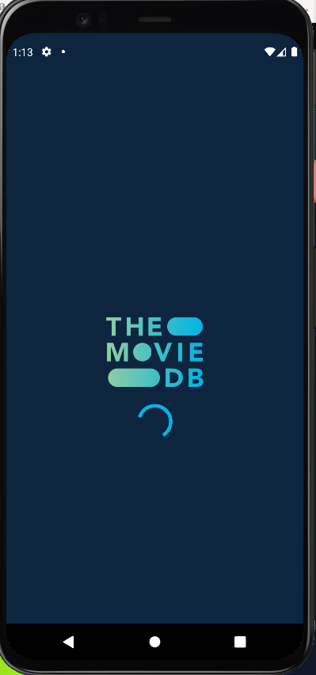
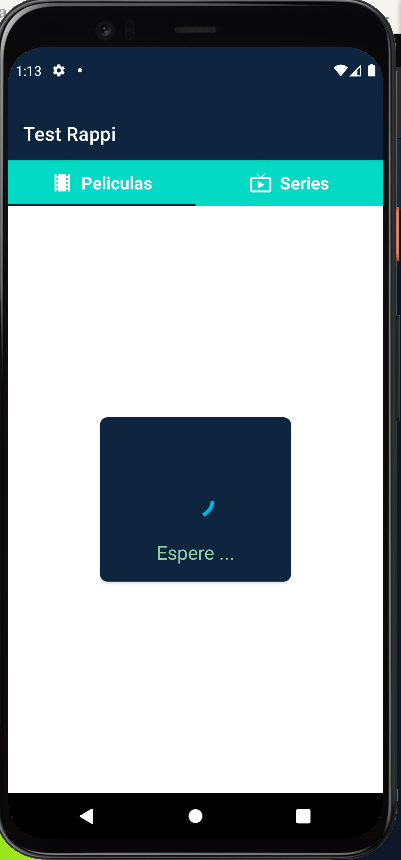
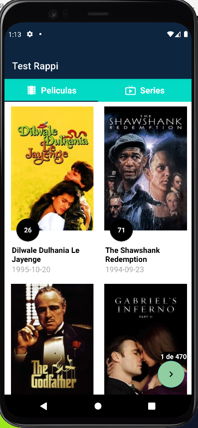
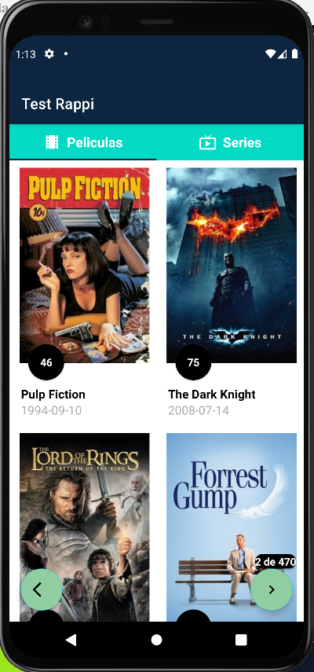

# Test-Rappi
<h2>Prueba para aplicar para la empresa Rappi</h2>  

 

 
# Descripción
● Películas y/o Series categorizadas por Popular y Top Rated.  
Esta implementada las parate de las peliculas Top Rated. La Serites esta implementadas las interfaces no que no implemete lavista (seria copiar la misma de las peliculas en lefragment de las series).
La Popular es poner el selector, en las vista para cambiar de TopRate a Popular, lo mismo en serie.
Esto lo pense hacer usando un combobox y asi cambiar el modelo de vista. 
● Detalle de Película y/o Serie.  
Implementar el patron Master/Detail. 
● Buscador de Películas y/o Series por nombre. 
Implementar un SearchView 
● Visualización de Videos en el detalle.  
Implementar en la vista de detalle
● La App debe poder funcionar offline.  
Implementar sqlite. 
● Pruebas Unitarias.  
Fue cumplido 
● Transiciones/Animaciones. Ejemplos: Entre un listado y detalle. En listados/detalle al hacer scroll.  
Cumplidos en las vistas implementadas 
● API: https://developers.themoviedb.org/  
Usando la libreria retrofit 
● Usar Kotlin.  
Cumplida 
● No hay restricción de bibliotecas externas.  
● Subir el proyecto a Github/Bitbucket/Gitlab o cualquier otro que utilice Git.  
https://github.com/HRDTech/Test-Rappi/ 
● La App debe ser escalable, con lo cual toda buena práctica que conozca aplíquela. ○ Usar algún patrón de arquitectura: ej. MVVM, MVP, etc. ○ Inyectar dependencias. Si se usa alguna biblioteca mejor. 
Usada la arquitetura MVVM. 
